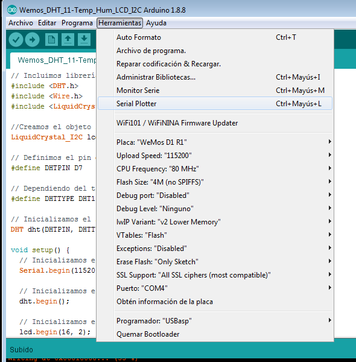
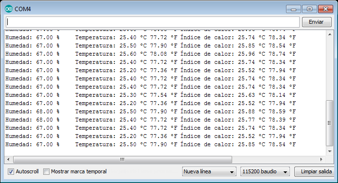

### WEMOS D1 R1 WIFI PROJECT EN ARDUINO IDE: DHT11 + I2C
Visualización de los datos de temperatura y humedad sobre una pantalla LCD con Wemos D1 R1

##### Elementos necesarios:
- Wemos D1 R1 Wifi
- Protoboard
- Sensor DHT11 de temperatura y humedad
- Pantalla LCD con acople I2C
- Cables

##### Software necesario:
- ArduinoIDE

##### Librerias necesarias:
- Adafruit DHT Humidity & Temperature Sensor Library: https://github.com/adafruit/DHT-sensor-library
- Adafruit Unified Sensor Library: https://github.com/adafruit/Adafruit_Sensor	
- New LiquidCrystal: https://bitbucket.org/fmalpartida/new-liquidcrystal/downloads/

##### Configuración de sensores:
- DHT11 - PIN 7 DIGITAL
- I2C   - PINES D15 (SCL) Y D14 (SDA)

#####  Referencias:
Codigo fuente DTH: https://programarfacil.com/blog/arduino-blog/sensor-dht11-temperatura-humedad-arduino/
Codigo fuente I2C: http://educ8s.tv/arduino-20x4-character-lcd/

Libreria DHT:      https://github.com/adafruit/DHT-sensor-library
Libreria LCD:      https://bitbucket.org/fmalpartida/new-liquidcrystal/downloads

##### Errores y como solucionarlos:
How to resolve “Board generic (platform esp8266, package esp8266) is unknown” error?:
	https://arduino-esp8266.readthedocs.io/en/latest/faq/a04-board-generic-is-unknown.html

##### Programacion en ArduinoIDE:

- Configuración:
	

- Salida de la ejecución en el monitor serie:
	

##### Enlaces interesantes de programacion con WEMOS D1:
WiFi ESP8266 Development Board WEMOS D1: 	https://alselectro.wordpress.com/2018/04/14/wifi-esp8266-development-board-wemos-d1/
ESP8266 WEMOS D1 With I2C Serial LCD: 		https://alselectro.wordpress.com/2018/04/16/esp8266-wemos-d1-with-i2c-serial-lcd/
